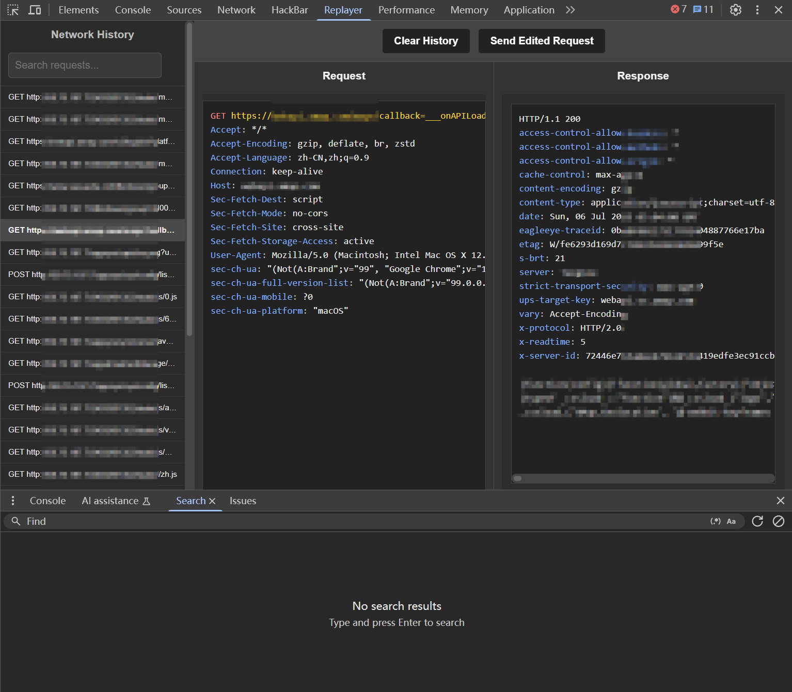

# Replayer
## 🚀 简介
Replayer 是一款强大的 Chrome 开发者工具扩展程序，旨在简化网络请求的捕获、查看、编辑和重放过程。无论您是调试 API、测试边缘案例，还是在开发过程中快速迭代，Replayer 都能为您提供直观且高效的工作流。
它在 Chrome DevTools 面板中提供了一个专门的界面，让您可以像管理请求历史一样，轻松地修改请求参数、头部和正文，然后立即发送以观察响应。

---
## ✨ 功能特性
+ 实时请求捕获: 自动捕获当前页面加载的所有 HTTP/HTTPS 网络请求。
+ 请求历史管理: 以列表形式展示捕获到的请求历史，支持通过方法、URL 或请求体内容进行搜索过滤。
+ 直观的请求查看和编辑:
  + 以可读的 HTTP 原始格式展示请求细节（方法、URL、HTTP 版本、头部和正文）。
  + 支持直接编辑请求的任何部分，包括方法、URL、头部和请求体。
  + 自动格式化 JSON 请求体，使其更易于阅读和修改。
+ 一键重放请求: 允许您发送修改后的请求，并实时观察服务器响应。
+ 响应显示和渲染:
  + 以格式化的文本（自动 JSON 美化）或 HTML 渲染模式显示原始响应。
  + 支持响应高亮显示（使用 Prism.js），提升可读性。
  + 暗黑模式支持: 根据您的系统主题自动适应暗黑模式，提供舒适的视觉体验。
  + 独立面板: 在 Chrome DevTools 中拥有自己的独立面板，保持界面整洁。

---
## 📷 使用截图

